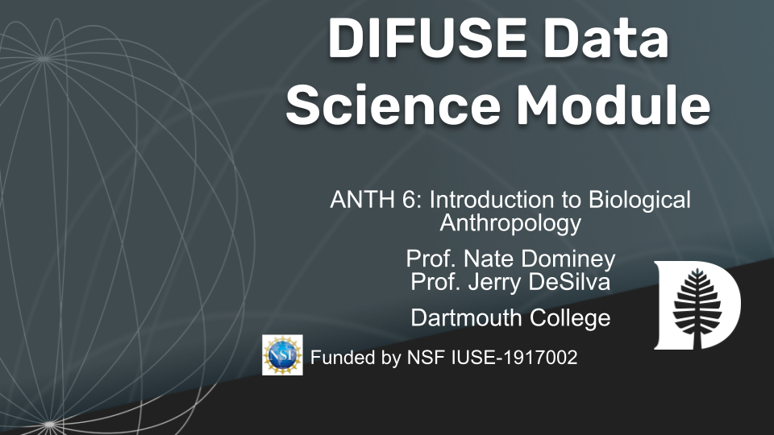

# ANTH06/40 DIFUSE Module 

## Contributors: Logan Sankey ('20), Taylor Hickey ('23),  Monika Roznere (GR), and Professor Lorie Loeb (PI) 

This module was developed through the DIFUSE project at Dartmouth College and funded by the National Science Foundation award IUSE-1917002.

 This work is licensed under a <a rel="license" href="http://creativecommons.org/licenses/by-sa/4.0/">Creative Commons Attribution-ShareAlike 4.0 International License</a>.

## Module Description 
This module is used to learn and apply the systematic steps that anthropologists would take to make deductible inferences about historical societies given the observations of fossil (foot print) records.

NOTE: Graphic below is WIP

(<a href="https://github.com/difuse-dartmouth/.github/blob/8f8f6efff8943871e1fcaa3b6f2daf1531206df6/profile/howto.md">What does this badge mean?</a>)

## [Click here for module materials](completed_module/README.md)

For instructors and interested parties, the history of this repository (with detailed commits), can be found [here](https://github.com/difuse-dartmouth/ANTH06-40_22F/commits/main/).

## Folder Structure

The folder *completed_module* contains all of the module components.  

The *components* subfolder contains ...

The *data* subfolder contains ...

The *logistics* subfolder contains ...
